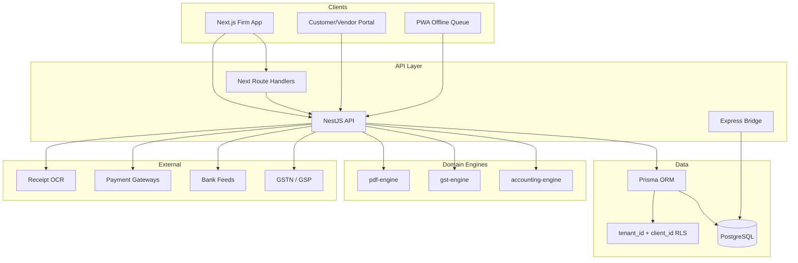

# LedgerFlow CRM → Zoho Books-Class Architecture

**Target:** Multi-tenant Indian GST accounting platform for CA firms managing hundreds of client books.  
**Stack:** Next.js 15 (App Router) + TypeScript + Tailwind + shadcn/ui · NestJS API · PostgreSQL + Prisma · Railway  
**Date:** July 2026

---

## 1. Scope confirmation

LedgerFlow already ships production-grade **GST Invoice Maker** (Rule 46, amount-in-words, PDF/Excel), **GSTR export v1.4.0** (200+ rules), **GSTR-2B recon**, **Returns Hub**, **Client Portal**, and **multi-tenant auth scaffolding**. This upgrade adds **full double-entry accounting** and every major Zoho Books India module while preserving those strengths via a strangler migration from the vanilla SPA + JSON store.

### Design principles

| Principle | Decision |
|-----------|----------|
| Tenancy | `tenantId` (CA firm) + `clientId` (business books) on every row |
| Books isolation | Each Client = one set of books (CoA, journals, inventory) |
| Posting model | Source documents → `JournalEntry` on post/approve (immutable after lock) |
| GST first | Tax lines always carry HSN/SAC, place of supply, ITC flags |
| Migration | New Next.js app reads/writes Postgres; legacy SPA bridges via API adapter |
| Indian defaults | CoA template (Schedule III friendly), FY Apr–Mar, INR base, 0/5/18/40% rates |

---

## 2. Monorepo folder structure

```
LedgerFlow-CRM/
├── apps/
│   ├── web/                          # Next.js 15 — firm + client portal UI
│   │   ├── src/
│   │   │   ├── app/
│   │   │   │   ├── (auth)/           # login, signup, OTP, Google
│   │   │   │   ├── (firm)/           # CA firm shell (sidebar)
│   │   │   │   │   ├── dashboard/
│   │   │   │   │   ├── clients/      # client picker → scoped books
│   │   │   │   │   ├── sales/        # quotes, SO, invoices, CN, DC
│   │   │   │   │   ├── purchases/    # PO, bills, expenses
│   │   │   │   │   ├── banking/      # accounts, feeds, recon
│   │   │   │   │   ├── inventory/    # items, stock, warehouses
│   │   │   │   │   ├── accounting/   # CoA, journals, budgets, assets
│   │   │   │   │   ├── gst/          # returns, 2B, e-invoice, e-way
│   │   │   │   │   ├── projects/     # projects, timesheets
│   │   │   │   │   ├── reports/      # P&L, BS, aging, GST
│   │   │   │   │   └── settings/     # roles, workflows, branding
│   │   │   │   ├── (portal)/         # customer/vendor self-service
│   │   │   │   └── api/              # Route handlers (BFF) where needed
│   │   │   ├── components/
│   │   │   │   ├── ui/               # shadcn primitives
│   │   │   │   ├── accounting/       # journal grid, CoA tree, ledger
│   │   │   │   ├── sales/            # invoice maker (ported + enhanced)
│   │   │   │   ├── banking/          # recon matcher UI
│   │   │   │   └── gst/              # returns hub, 2B recon
│   │   │   ├── lib/
│   │   │   │   ├── api-client.ts
│   │   │   │   ├── auth.ts
│   │   │   │   └── tenant-context.tsx
│   │   │   └── hooks/
│   │   └── public/                   # PWA manifest, fonts (Indian PDF)
│   │
│   └── api/                          # NestJS 11 REST + WebSocket
│       ├── src/
│       │   ├── main.ts
│       │   ├── app.module.ts
│       │   ├── common/
│       │   │   ├── guards/           # JwtAuth, Roles, TenantScope
│       │   │   ├── interceptors/     # AuditLog, RLS injection
│       │   │   └── prisma/           # PrismaService + middleware
│       │   └── modules/
│       │       ├── auth/
│       │       ├── tenants/
│       │       ├── clients/
│       │       ├── contacts/
│       │       ├── accounting/       # CoA, journals, periods
│       │       ├── sales/
│       │       ├── purchases/
│       │       ├── banking/
│       │       ├── inventory/
│       │       ├── gst/
│       │       ├── projects/
│       │       ├── reports/
│       │       ├── automation/
│       │       └── documents/
│       └── test/
│
├── packages/
│   ├── db/                           # Prisma schema + migrations + seed
│   │   ├── schema.prisma
│   │   ├── seed/
│   │   │   ├── indian-coa.ts
│   │   │   └── demo-client.ts
│   │   └── src/client.ts
│   │
│   ├── accounting-engine/            # Pure TS double-entry core
│   │   └── src/
│   │       ├── chart-of-accounts.ts  # Indian template + tree ops
│   │       ├── posting-engine.ts     # Invoice/Bill/Journal → entries
│   │       ├── period-lock.ts
│   │       └── reports/              # Trial balance, P&L helpers
│   │
│   ├── gst-engine/                   # Existing — validators, 2B matcher
│   │   └── src/
│   │       ├── validators.ts
│   │       ├── matcher.ts
│   │       ├── gstr-export/          # Port from gstr-return-export.js
│   │       └── e-invoice/            # IRN/QR schema
│   │
│   ├── pdf-engine/                   # @react-pdf + amount-in-words
│   ├── shared/                       # Zod schemas, money utils, dates (IST)
│   └── ui/                           # Shared shadcn wrappers (optional)
│
├── backend/                          # Legacy Express (bridge until cutover)
│   └── adapters/                     # JSON ↔ Prisma sync (temporary)
│
├── legacy/                           # Current vanilla SPA (frozen, linked)
│   └── (existing *.js at root — move gradually)
│
├── docs/
├── railway.toml
└── package.json                      # Turborepo / pnpm workspaces
```

---

## 3. System architecture



### Request context (every API call)

```typescript
interface RequestContext {
  tenantId: string;      // CA firm
  clientId: string;      // Active books (from header / route)
  userId: string;
  role: UserRole;
  permissions: string[];
  fiscalYear: string;    // e.g. "2025-26"
}
```

Prisma middleware injects `tenantId` + `clientId` filters on all queries. Super-admin bypasses for firm management only.

---

## 4. Double-entry integration with GST Invoice Maker

```
┌─────────────────┐     post()      ┌──────────────────┐
│  Sales Invoice  │ ──────────────► │  JournalEntry    │
│  (GST lines)    │                 │  Dr Debtors      │
└─────────────────┘                 │  Cr Sales        │
                                    │  Cr CGST/SGST/IGST│
                                    └──────────────────┘
```

| Document | Debit | Credit |
|----------|-------|--------|
| Tax Invoice | Accounts Receivable | Sales + CGST/SGST/IGST |
| Bill of Supply | AR | Sales (nil/exempt) |
| Credit Note | Sales + Tax | AR |
| Vendor Bill | Expense/Inventory + ITC | Accounts Payable |
| Payment received | Bank | AR |
| Payment made | AP | Bank |
| Manual Journal | (balanced lines) | |

**Rule:** `JournalEntry.totalDebit === totalCredit` enforced in `posting-engine.ts` before DB write. Posted entries cannot be edited — only reversed via contra journal.

---

## 5. Module mapping (Zoho Books → LedgerFlow)

| Zoho module | LedgerFlow package / route | Status |
|-------------|---------------------------|--------|
| Invoices | `legacy` + `apps/web/sales` | **Strong** — enhance posting |
| GSTR-1/3B/9 | `gst-engine` + Returns Hub | **Strong** |
| GSTR-2B recon | `gst-engine/matcher` | **Strong** |
| Bank recon | `bank-reconciliation.js` | **Good** — port to Nest |
| Chart of Accounts | `accounting-engine` | **New** |
| Journals | `accounting-engine` | **New** |
| Quotes / SO | `sales` module | New |
| PO / Bills | `purchases` module | Partial (Purchase model exists) |
| Inventory | `inventory` module | New |
| e-Invoice / e-Way | `gst/e-invoice` | Partial (EWB demo exists) |
| Projects | `projects` module | New |
| Reports | `reports` module | New |
| Automation | `automation` module | Partial (reminders in SPA) |

---

## 6. Prioritized implementation roadmap

### Phase 1 — Core accounting + GST (Months 1–3) ⭐ START HERE

| # | Deliverable | Depends on |
|---|-------------|------------|
| 1.1 | Postgres migration + Prisma client + RLS middleware | schema.prisma |
| 1.2 | NestJS API scaffold + auth + tenant/client guards | 1.1 |
| 1.3 | Chart of Accounts (Indian template, tree UI) | 1.1, accounting-engine |
| 1.4 | Journal Entry system (manual + recurring + templates) | 1.3 |
| 1.5 | Posting engine (Invoice/Bill/Payment → journals) | 1.4 |
| 1.6 | Sales cycle: Quote → SO → Invoice (port GST maker) | 1.5 |
| 1.7 | Purchase cycle: PO → Bill + expense | 1.5 |
| 1.8 | GSTR-2B recon (port matcher to API) | existing gst-engine |
| 1.9 | GSTR export API (port v1.4.0) | 1.8 |
| 1.10 | Next.js firm shell + shadcn + client switcher | 1.2 |
| 1.11 | P&L, Trial Balance, Day Book reports | 1.5 |
| 1.12 | JSON store → Postgres migration script | 1.1 |

### Phase 2 — Inventory + Banking (Months 4–6)

| # | Deliverable |
|---|-------------|
| 2.1 | Item master (HSN/SAC), price lists |
| 2.2 | Stock movements, warehouses, valuation (FIFO/WAvg) |
| 2.3 | Bank accounts + CSV/OFX import |
| 2.4 | Bank feeds connector (Perfios / Finbox / manual) |
| 2.5 | Bank recon UI (port smart matcher) |
| 2.6 | Multi-bank, cash flow forecast |
| 2.7 | Credit notes / debit notes full lifecycle |
| 2.8 | Recurring invoices & bills |
| 2.9 | Payment links + Razorpay/Stripe India |
| 2.10 | Customer portal (view/pay statements) |

### Phase 3 — Projects + Advanced (Months 7–12)

| # | Deliverable |
|---|-------------|
| 3.1 | Projects, time tracking, timesheet billing |
| 3.2 | Fixed assets + depreciation |
| 3.3 | Budgets + variance |
| 3.4 | Cost centers / tracking categories |
| 3.5 | Approval workflows |
| 3.6 | e-Invoice IRN + QR (GSP) |
| 3.7 | IMS full lifecycle |
| 3.8 | OCR receipt scan |
| 3.9 | 50+ reports + scheduled email |
| 3.10 | Custom fields, custom modules |
| 3.11 | Vendor portal |
| 3.12 | Payroll integration ready |

---

## 7. Security & compliance

- **RLS:** PostgreSQL policies on `tenant_id`; application-level `client_id` filter
- **Audit:** Every mutation → `AuditLog` (before/after JSON)
- **Period lock:** No posting to locked months
- **GST 2026:** IMS actions, 3B hard-lock awareness, e-invoice ₹5 Cr threshold flag per client
- **PII:** Encrypt bank tokens at rest; mask in logs

---

## 8. UI quality bar (Zoho Books parity)

- shadcn/ui DataTable with server pagination, column filters, export
- Command palette (⌘K) for quick navigation
- Optimistic updates + skeleton loaders on all lists
- Dark mode via `next-themes`
- Inline editing on journal lines (spreadsheet feel)
- Client switcher always visible in firm header
- Amount formatting: `en-IN` locale, ₹ symbol, amount-in-words on PDF preview

---

## 9. Next coding steps (immediate)

1. ✅ This document + `packages/db/schema.prisma`
2. `packages/accounting-engine` — CoA seed + posting engine
3. `apps/api` — NestJS bootstrap with accounting module
4. `apps/web` — shadcn init + CoA tree + journal entry page
5. Bridge: expose posting via legacy Express for parallel run